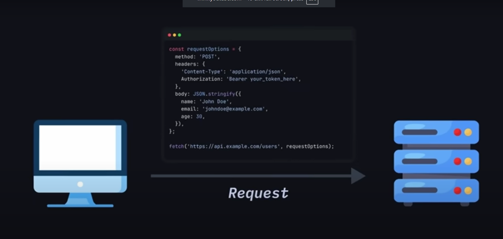
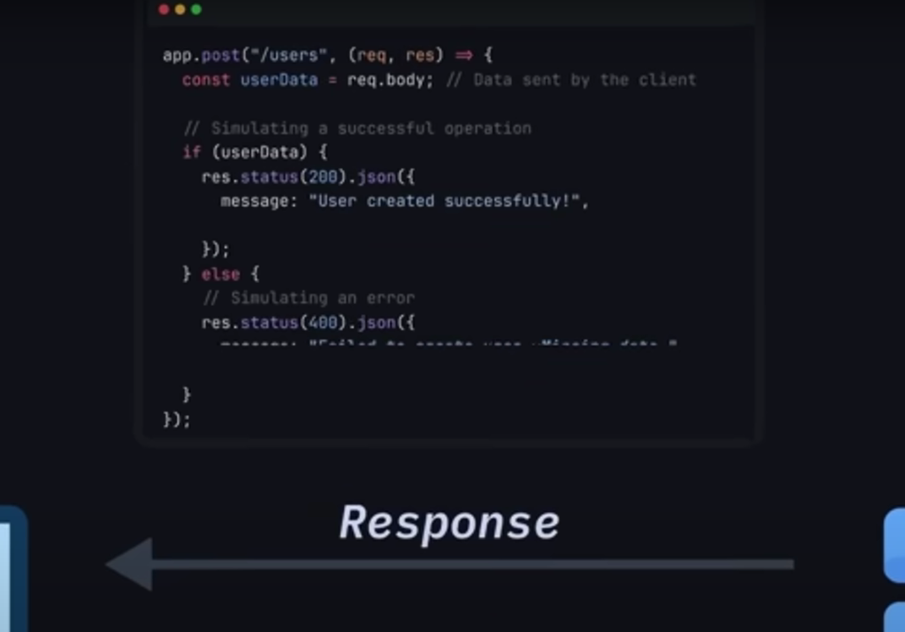
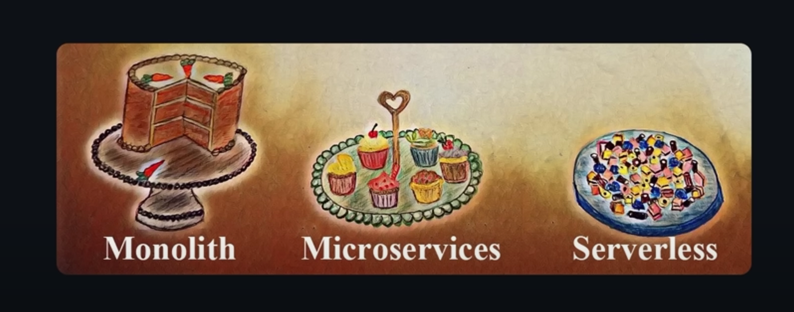

## Backend by Javascript Mastery

### Basics of backend

When we send request to backend from frontend.
**This is how request goes with data.**



**Then it processes the data and sent back the response. just like below**



---

### Different types of API you will encounter

1. **RESTfull APIs** - the API uses APIs and **http** methods. Each request is independent and doesn't rely on each other.

like - http://api.example.com/user -- method - `GET`, `PATCH`, `POST`..

2. **GraphQl APIs** - Developed by facebook which offers more flexiblity than REST APIs by **letting clients request exactly the data they need**.

**Instead of multiple endpoints for different data.**

**eg:- For user - http://api/v1/user**
**eg:- For video - http://api/v1/video**

**GraphQl uses single end point i.e. `/graphql` end point and then clients can specify that exact fields they want without previously defined them in code.** _which is super efficient for complex application and super interconnected data_

---

### Backend architecture

#### There are few popular Backend Architecture.



---

## 🏗️ What is Backend Architecture?

**Backend Architecture** is the **blueprint** of how your backend system is structured — how components like databases, APIs, servers, business logic, caching, and third-party services interact.

Think of it like the **engine room** of your web or mobile app.

---

## 📦 Why It Matters?

Backend architecture decides:

- Performance 🔥
- Scalability 📈
- Cost efficiency 💰
- Developer experience 👨‍💻
- Maintainability 🛠️

---

## 🧱 Components of Backend Architecture

| Component          | Role                                                       |
| ------------------ | ---------------------------------------------------------- |
| **Server**         | Handles requests (Node.js, Python, Go, etc.)               |
| **Routing Layer**  | Directs requests to correct controller or handler          |
| **Controllers**    | Contains logic for each endpoint (GET /videos, POST /like) |
| **Services**       | Business logic layer (subscriptions, payments, etc.)       |
| **Database**       | Stores persistent data (PostgreSQL, MongoDB)               |
| **Cache**          | Speeds up responses (Redis, Memcached)                     |
| **Authentication** | Protects routes (JWT, OAuth, sessions)                     |
| **Queue Workers**  | Background jobs (emails, payment retries)                  |
| **API Gateway**    | Routes traffic in microservices                            |
| **Monitoring**     | Logs, metrics, error tracking (Sentry, Prometheus)         |

---

## 🧠 Types of Backend Architectures

Here’s how backend architectures are **categorized**:

---

### 1. **Monolithic Architecture** (💡 Simple MVPs)

#### 🔧 What:

All logic (API, DB access, etc.) in **one codebase and server**.

#### ✅ Pros:

- Easy to build and deploy
- Great for early-stage startups

#### ❌ Cons:

- Hard to scale
- Any bug can crash everything

#### 👁️ Example:

```plaintext
[Frontend] → [Monolithic Server (API + DB logic + Auth)] → [Database]
```

---

### 2. **Microservices Architecture** (⚙️ Scalable SaaS/Enterprises)

#### 🔧 What:

System broken into **small, independent services**, each doing one thing.

#### ✅ Pros:

- Scales well
- Easy to maintain, update services independently

#### ❌ Cons:

- Complexity
- Requires DevOps and infrastructure setup

#### 👁️ Example:

```plaintext
[Frontend] → [API Gateway] → [Auth Service]
                        → [Payment Service]
                        → [User Service]
                        → [DBs for each]
```

---

### 3. **Serverless Architecture** (🧠 Pay-as-you-use + scalable)

#### 🔧 What:

Uses cloud functions (like AWS Lambda) that run on demand — **no need to manage servers**.

#### ✅ Pros:

- Cheap for small workloads
- Auto-scales
- No server maintenance

#### ❌ Cons:

- Cold start delay
- Can be hard to debug

---

### 4. **Event-Driven Architecture** (📩 Reactive systems)

#### 🔧 What:

Components communicate by **sending/receiving events** (Kafka, RabbitMQ, etc.)

#### ✅ Pros:

- Real-time capabilities
- Loose coupling of services

#### ❌ Cons:

- Harder to test/debug
- More infra needed

#### 👁️ Use Case:

- Chat apps
- Payment notifications
- Subscription lifecycle triggers

---

### 5. **Hybrid Architecture** (Most real-world SaaS)

You might start monolithic, then split parts into services:

- Monolith for core
- Microservice for payments
- Serverless for webhooks

---

## 💼 Which Architecture Should You Use?

| Stage             | Recommended Architecture                   |
| ----------------- | ------------------------------------------ |
| Learning Projects | Monolithic (e.g., Express.js + MongoDB)    |
| MVP / Startup     | Monolithic with modular code or serverless |
| Scaling SaaS      | Microservices + queues + caching           |
| Real-Time Systems | Event-driven + WebSockets                  |

---

## 🚀 Pro-Move: Layered Architecture Inside Backend

Even in a monolith, use this structure:

```
controllers/     → handle HTTP requests
services/        → business logic
models/          → DB schemas (ORMs)
middlewares/     → auth, logging
utils/           → helpers
routes/          → API routes
```

---

### API setup and demo

1. We are going to use **httpie**. an alternative to **Postman**

---

### Here Start actual coding

#### 1. Set up of Upstash - Redis, Vector and Qstash

Great question, Shubham! You're seeing real-world dev setup in action. Let's **break it down like a pro**:

---

### 🧰 Command:

```bash
npx express-generator --no-view --git ./
```

This is using **Express Generator**, a tool to scaffold (generate) a basic Express.js project **instantly**.

---

### 🧠 Breakdown of Each Part:

| Part                | Meaning                                                                                             |
| ------------------- | --------------------------------------------------------------------------------------------------- |
| `npx`               | Runs a package without installing it globally. Comes with Node.js                                   |
| `express-generator` | Tool that generates boilerplate Express.js app                                                      |
| `--no-view`         | Skips template engine (like EJS or Pug). You're building an **API backend**, so views aren't needed |
| `--git`             | Initializes a **Git repo** inside the folder automatically                                          |
| `./`                | Target directory is the **current folder** (not a new one)                                          |

---

Now, delete folders - `bin, routes and public` and also delete content of **app.js**, not file of app.js.

### Now linter for clean code base and scalability

we are using here **ESlint**. most common for JS.
It actually format and maintain clean code through out our folder.

Run following command

```
npx eslint --init
```

---

Set up completed.

---

### Start creating express server

---

### env config

Create a folder `config`. inside it, create file **env.js**

_env.js_

```javascript
import { config } from "dotenv";

config({ path: `.env.${process.env.NODE_ENV || "development"}.local` });

export const { PORT } = process.env;
```

also create two files.

1. `.env.production.local`
2. `.env.development.local`

inside .env.production.local - `NODE_ENV='production'`

inside .env.development.local - `your actual envs`.

Now you can import envs from env.js

### Set up our routes

---

### Database setup

---
